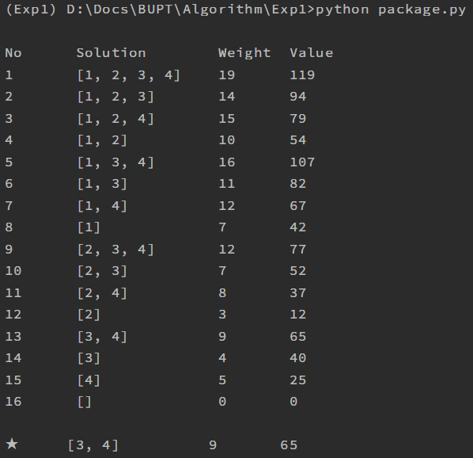
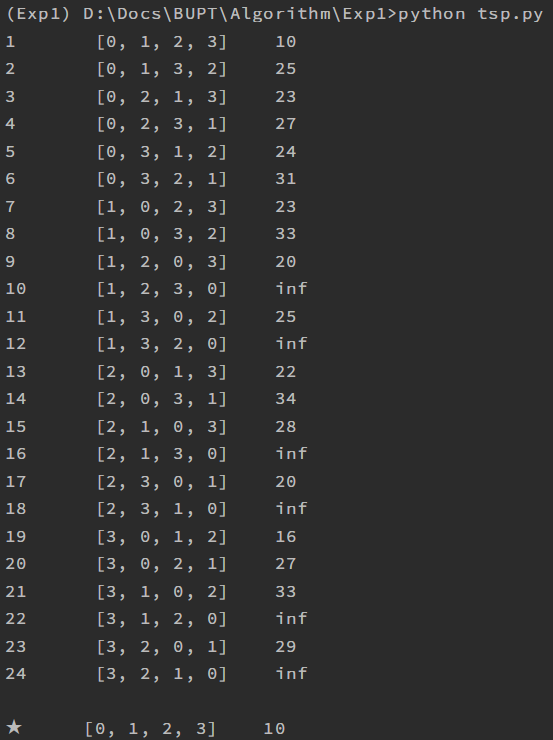

# Algorithm Analysis And Design
For BUPT course usage. 

- [Algorithm Analysis And Design](#algorithm-analysis-and-design)
  - [Brute-Force](#brute-force)
    - [0-1 Package Problem](#0-1-package-problem)
    - [TSP Problem](#tsp-problem)

## Brute-Force  
### 0-1 Package Problem  
- [tree](source/tree.py)  
- [package](source/package.py)  
  
  

### TSP Problem  
- [tree](source/tree.py)  
- [TSP](source/tsp.py)  

  